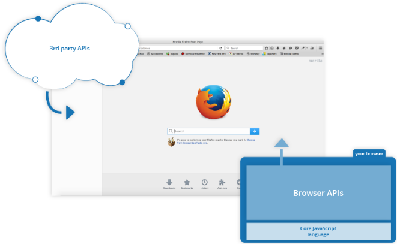
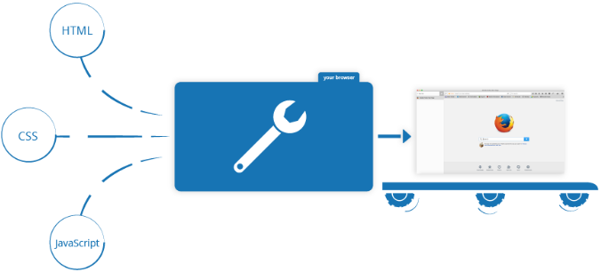

# JavaScript 基础
JavaScript ( JS ) 是一种具有函数优先的轻量级，解释型或即时编译型的编程语言

JavaScript 的标准是 ECMAScript 。截至 2012 年，所有的现代浏览器都完整的支持  ECMAScript 5.1，旧版本的浏览器至少支持 ECMAScript 3 标准。2015年6月17日，ECMA国际组织发布了 ECMAScript 的第六版，该版本正式名称为 ECMAScript 2015，但通常被称为 ECMAScript 6 或者 ES6。自此，ECMAScript 每年发布一次新标准。本文档目前覆盖了最新 ECMAScript 的草案，也就是 ECMAScript2020。

<br>

#### **一，广义定义**
JavaScript 是一种脚本，一门编程语言，它可以在网页上实现复杂的功能，网页展现给你的不再是简单的静态信息，而是实时的内容更新，交互式的地图，2D/3D 动画，滚动播放的视频等等。JavaScript 怎能缺席。它是标准 Web 技术蛋糕的第三层，其中 HTML 和 CSS 我们已经在学习中心的其他部分进行了详细的讲解。

* HTML是一种标记语言，用来结构化我们的网页内容并赋予内容含义，例如定义段落、标题和数据表，或在页面中嵌入图片和视频。
* CSS 是一种样式规则语言，可将样式应用于 HTML 内容， 例如设置背景颜色和字体，在多个列中布局内容
* JavaScript 是一种脚本语言，可以用来创建动态更新的内容，控制多媒体，制作图像动画，还有很多。（好吧，虽然它不是万能的，但可以通过简短的代码来实现神奇的功能。）

这三层依次建立，秩序井然。以文本标签(text label)的简单示例。首先用 HTML 将文本标记起来，从而赋予它结构和目的：
`<p>玩家1：小明</p>`

然后我们可以为它加一点 CSS 让它更好看：
```js
p {
  font-family: sans-serif, '黑体';
  letter-spacing: 1px;
  text-transform: uppercase;
  text-align: center;
  border: 2px solid rgba(0, 0, 200, 0.6);
  background: rgba(0, 0, 200, 0.3);
  color: rgba(0, 0, 200, 0.6);
  box-shadow: 1px 1px 2px rgba(0, 0, 200, 0.4);
  border-radius: 10px;
  padding: 3px 10px;
  display: inline-block;
  cursor: pointer;
}
```
最后，我们可以再加上一些 JavaScript 来实现动态行为：
```js
const para = document.querySelector('p');

para.addEventListener('click', updateName);

function updateName() {
  let name = prompt('输入一个新的名字：');
  para.textContent = '玩家1：' + name;
}
```

#### **二，JS可以做什么？**
客户端（client-side）JavaScript 语言的核心包含一些普遍的编程特性，以让你可以做到如下的事情：
* 在变量中储存有用的值。比如上文的示例中，我们请求客户输入一个新名字，然后将其储存到 `name` 变量中
* 操作一段文本（在编程中称为“字符串”（string））。上文的示例中，我们取字符串 "玩家1："，然后把它和 `name` 变量连结起来，创造出完整的文本标签，比如："玩家1：小明"。
* 运行代码以响应网页中发生的特定事件。上文的示例中，我们用一个 click 事件来检测按钮什么时候被点击，然后运行代码更新文本标签
* 以及更多！

JavaScript 语言核心之上所构建的功能更令人兴奋。**应用程序接口（Application Programming Interfaces（API））** 将为你的代码提供额外的超能力。

**API 通常分为两类**

浏览器 API 内建于 web 浏览器中，它们可以将数据从周边计算机环境中筛选出来，还可以做实用的复杂工作。例如:

* [文档对象模型 API（DOM（Document Object Model）API）](https://developer.mozilla.org/zh-CN/docs/Web/API/Document_Object_Model) 能通过创建、移除和修改 HTML，为页面动态应用新样式等手段来操作 HTML 和 CSS。比如当某个页面出现了一个弹窗，或者显示了一些新内容（像上文小 demo 中看到那样），这就是 DOM 在运行。
* [地理位置 API（Geolocation API）](https://developer.mozilla.org/zh-CN/docs/Web/API/Geolocation) 获取地理信息。这就是为什么 谷歌地图 可以找到你的位置，而且标示在地图上。
* [画布（Canvas）](https://developer.mozilla.org/zh-CN/docs/Web/API/Canvas_API) 和 [WebGL API](https://developer.mozilla.org/zh-CN/docs/Web/API/WebGL_API) 可以创建生动的 2D 和 3D 图像。人们正运用这些 web 技术制作令人惊叹的作品。参见 Chrome Experiments 以及 webglsamples。
* 诸如 [HTMLMediaElement](https://developer.mozilla.org/zh-CN/docs/Web/API/HTMLMediaElement) 和 [WebRTC](https://developer.mozilla.org/zh-CN/docs/Web/API/WebRTC_API) 等 影音类 API 让你可以利用多媒体做一些非常有趣的事，比如在网页中直接播放音乐和影片，或用自己的网络摄像头获取录像，然后在其他人的电脑上展示（试用简易版 截图 demo 以理解这个概念）。

**Tips:**
 上述很多演示都不能在旧浏览器中运行。推荐你在测试代码时使用诸如 Firefox, Chrome, Edge 或者 Opera 等现代浏览器。当代码即将交付生产环境时（也就是真实的客户即将使用真实的代码时），你还需要深入考虑 跨平台测试

**第三方 API 并没有默认嵌入浏览器中，一般要从网上取得它们的代码和信息。**
比如：
* Twitter API、新浪微博 API 可以在网站上展示最新推文之类。
* 谷歌地图 API、高德地图 API 可以在网站嵌入定制的地图等等。

<br>

#### **三，JavaScript 在页面上做了什么？**

现在我们实实在在的学习一些代码，与此同时，探索 JavaScript 运行时背后发生的事情。

让我们简单回顾一下，浏览器在读取一个网页时都发生什么（CSS 如何工作 一文中首次谈及）。浏览器在读取一个网页时，代码（HTML, CSS 和 JavaScript）将在一个运行环境（浏览器标签页）中得到执行。就像一间工厂，将原材料（代码）加工为一件产品（网页）。



在 HTML 和 CSS 集合组装成一个网页后，浏览器的 JavaScript 引擎将执行 JavaScript 代码。这保证了当 JavaScript 开始运行之前，网页的结构和样式已经就位。

这样很好，因为<u>JavaScript 最普遍的用处是通过 DOM API（见上文）动态修改 HTML 和 CSS 来更新用户界面 （user interface）。</u>如果 JavaScript 在 HTML 和 CSS 就位之前加载运行，就会引发错误。

##### **-3.1- 浏览器安全**
每个浏览器标签页就是其自身用来运行代码的独立容器（这些容器用专业术语称为“运行环境”）。大多数情况下，每个标签页中的代码完全独立运行，而且一个标签页中的代码不能直接影响另一个标签页（或者另一个网站）中的代码。这是一个好的安全措施，如果不这样，黑客就可以从其他网站盗取信息，等等。

**Tips:** 以安全的方式在不同网站/标签页中传送代码和数据的方法是存在的
##### **-3.2- JavaScript 运行次序**
当浏览器执行到一段 JavaScript 代码时，通常会按从上往下的顺序执行这段代码。这意味着你需要注意代码书写的顺序。比如，我们回到第一个例子中的 JavaScript 代码：
```js
const para = document.querySelector('p');

para.addEventListener('click', updateName);

function updateName() {
  let name = prompt('输入一个新的名字：');
  para.textContent = '玩家1：' + name;
}
```
这里我们选定一个文本段落（第 1 行)，然后给它附上一个事件监听器（第 3 行），使得在它被点击时，`updateName()` 代码块（code block） （5 – 8 行）便会运行。`updateName()` （这类可以重复使用的代码块称为“函数”）向用户请求一个新名字，然后把这个名字插入到段落中以更新显示。

如果你互换了代码里最初两行的顺序，会导致问题。浏览器开发者控制台将返回一个错误： `TypeError: para is undefined`。这意味着 `para` 对象还不存在，所以我们不能为它增添一个事件监听器。

##### **-3.3- 解释代码 vs 编译代码**
作为程序员，你或许听说过这两个术语：解释（interpret）和 编译(compile)。在解释型语言中，代码自上而下运行，且实时返回运行结果。代码在由浏览器执行前，不需要将其转化为其他形式。代码将直接以文本格式（text form）被接收和处理。

相对的，编译型语言需要先将代码转化（编译）成另一种形式才能运行。比如 C/C++ 先被编译成汇编语言，然后才能由计算机运行。程序将以二进制的格式运行，这些二进制内容是由程序源代码产生的。

JavaScript 是轻量级解释型语言。浏览器接受到JavaScript代码，并以代码自身的文本格式运行它。技术上，几乎所有 JavaScript 转换器都运用了一种叫做即时编译（just-in-time compiling）的技术；当 JavaScript 源代码被执行时，它会被编译成二进制的格式，使代码运行速度更快。尽管如此，JavaScript 仍然是一门解释型语言，因为编译过程发生在代码运行中，而非之前。

两种类型的语言各有优势，这个问题我们暂且不谈

##### **-3.4- 服务器端代码 vs 客户端代码**

你或许还听说过**服务器端（server-side）和 客户端（client-side）代码**这两个术语，尤其是在web开发时。客户端代码是在用户的电脑上运行的代码，在浏览一个网页时，它的客户端代码就会被下载，然后由浏览器来运行并展示。这就是**客户端 JavaScript**。

而服务器端代码在服务器上运行，接着运行结果才由浏览器下载并展示出来。流行的服务器端 web 语言包括：PHP、Python、Ruby、ASP.NET 以及...... JavaScript！JavaScript 也可用作服务器端语言，比如现在流行的 Node.js 环境，你可以在我们的 动态网页 - 服务器端编程 主题中找到更多关于服务器端 JavaScript 的知识。

##### **-3.5- 动态代码 vs 静态代码**
“**动态**”一词既适用于客户端 JavaScript，又适用于描述服务器端语言。是指通过按需生成新内容来更新 web 页面 / 应用，使得不同环境下显示不同内容。服务器端代码会在服务器上动态生成新内容，例如从数据库中提取信息。而客户端 JavaScript 则在用户端浏览器中动态生成新内容，比如说创建一个新的 HTML 表格，用从服务器请求到的数据填充，然后在网页中向用户展示这个表格。两种情况的意义略有不同，但又有所关联，且两者（服务器端和客户端）经常协同作战。

没有动态更新内容的网页叫做“静态”页面，所显示的内容不会改变。

#### **四，怎样向页面添加 JavaScript？**
可以像添加 CSS 那样将 JavaScript 添加到 HTML 页面中。CSS 使用 `<link>` 元素链接外部样式表，使用 `<style>` 元素向 HTML 嵌入内部样式表，JavaScript 这里只需一个元素——`<script>`。我们来看看它是怎么工作的。

##### **-4.1- 内部 JavaScript**
1. 首先，下载示例文件 apply-javascript.html。放在一个好记的文件夹里。
2. 分别在浏览器和文本编辑器中打开这个文件。你会看到这个 HTML 文件创建了一个简单的网页，其中有一个可点击按钮。
3. 然后转到文本编辑器，在 `</body>` 标签结束前插入以下代码：
```javascript
<script>

  // 在此编写 JavaScript 代码

</script>
```
4. 下面，在 `<script>` 元素中添加一些 JavaScript 代码，这个页面就能做一些更有趣的事。在“/ /在此编写 JavaScript 代码”一行下方添加以下代码：
```js
document.addEventListener("DOMContentLoaded", function() {
  function createParagraph() {
    let para = document.createElement('p');
    para.textContent = '你点击了这个按钮！';
    document.body.appendChild(para);
  }

  const buttons = document.querySelectorAll('button');

  for(let i = 0; i < buttons.length ; i++) {
    buttons[i].addEventListener('click', createParagraph);
  }
});
```
5. 保存文件并刷新浏览器，然后你会发现，点击按钮文档下方将会添加一个新段落。

**Tips:** JavaScript 是区分大小写的，而且非常精确，所以你需要准确无误地输入所示的句法，否则可能会出错。

##### **-4.2- 外部 JavaScript**
这很不错，但是能不能把 JavaScript 代码放置在一个外部文件中呢？现在我们来研究一下。

1. 首先，在刚才的 HTML 文件所在的目录下创建一个名为 script.js 的新文件。请确保扩展名为 .js，只有这样才能被识别为 JavaScript 代码。
2. 将 `<script>` 元素替换为：
`<script src="script.js" async></script>`
3. 在 script.js 文件中，添加下面的脚本：
```js
function createParagraph() {
  let para = document.createElement('p');
  para.textContent = '你点击了这个按钮！';
  document.body.appendChild(para);
}

const buttons = document.querySelectorAll('button');

for(let i = 0; i < buttons.length ; i++) {
  buttons[i].addEventListener('click', createParagraph);
} 
```
4. 保存并刷新浏览器，你会发现二者完全一样。但是现在我们把 JavaScript 写进了一个外部文件。这样做一般会使代码更加有序，更易于复用，且没有了脚本的混合，HTML 也会更加易读，因此这是个好的习惯。

##### **-4.3- 内联 JavaScript 处理器**
注意，有时候你会遇到在 HTML 中存在着一丝真实的 JavaScript 代码。它或许看上去像这样：
```js
function createParagraph() {
  const para = document.createElement('p');
  para.textContent = '你点击了这个按钮！';
  document.body.appendChild(para);
}
```
```js
<button onclick="createParagraph()">点我呀</button>
```

这个 demo 与之前的两个功能完全一致，只是在 `<button>` 元素中包含了一个内联的 onclick 处理器，使得函数在按钮被按下时运行。

**然而请不要这样做**。 这将使 JavaScript 污染到 HTML，而且效率低下。对于每个需要应用 JavaScript 的按钮，你都得手动添加 onclick="createParagraph()" 属性。

可以使用纯 JavaScript 结构来通过一个指令选取所有按钮。下文的这段代码即实现了这一目的：
```js
const buttons = document.querySelectorAll('button');

for(let i = 0; i < buttons.length ; i++) {
  buttons[i].addEventListener('click', createParagraph);
}
```
这样写乍看去比 onclick 属性要长一些，但是这样写会对页面上所有按钮生效，无论多少个，或添加或删除，完全无需修改 JavaScript 代码。

##### **-4.4- 脚本调用策略**
要让脚本调用的时机符合预期，需要解决一系列的问题。这里看似简单，实际大有文章。最常见的问题就是：HTML 元素是按其在页面中出现的次序调用的，如果用 JavaScript 来管理页面上的元素（更精确的说法是使用 文档对象模型 DOM），若 JavaScript 加载于欲操作的 HTML 元素之前，则代码将出错。

在上文的“内部”、“外部”示例中，JavaScript 调用于文档头处，解析 HTML 文档体之前。这样做是有隐患的，需要使用一些结构来避免错误发生。

“内部”示例使用了以下结构：
```js
document.addEventListener("DOMContentLoaded", function() {
  . . .
});
```
这是一个事件监听器，它监听浏览器的 "`DOMContentLoaded`" 事件，即 HTML 文档体加载、解释完毕事件。事件触发时将调用 " `. . .`" 处的代码，从而避免了错误发生（事件 的概念稍后学习）。

“外部”示例中使用了 JavaScript 的一项现代技术（`async` “异步”属性）来解决这一问题，它告知浏览器在遇到 `<script>` 元素时不要中断后续 HTML 内容的加载。
```js
<script src="script.js" async></script>
```

上述情况下，脚本和 HTML 将一并加载，代码将顺利运行。

解决此问题的旧方法是：把脚本元素放在文档体的底端（`</body>` 标签之前，与之相邻），这样脚本就可以在 HTML 解析完毕后加载了。此方案（以及上述的 `DOMContentLoaded` 方案）的问题是：只有在所有 HTML DOM 加载完成后才开始脚本的加载/解析过程。对于有大量 JavaScript 代码的大型网站，可能会带来显著的性能损耗。这也是 `async` 属性诞生的初衷。

##### **-4.5- async 和 defer**

上述的脚本阻塞问题实际有两种解决方案 —— `async` 和 `defer`。我们来依次讲解。

浏览器遇到 `async` 脚本时不会阻塞页面渲染，而是直接下载然后运行。这样脚本的运行次序就无法控制，只是脚本不会阻止剩余页面的显示。当页面的脚本之间彼此独立，且不依赖于本页面的其它任何脚本时，`async` 是最理想的选择。

比如，如果你的页面要加载以下三个脚本：
```js
<script async src="js/vendor/jquery.js"></script>

<script async src="js/script2.js"></script>

<script async src="js/script3.js"></script>
```
三者的调用顺序是不确定的。`jquery.js` 可能在 `script2` 和 `script3` 之前或之后调用，如果这样，后两个脚本中依赖 `jquery` 的函数将产生错误，因为脚本运行时 `jquery` 尚未加载。

解决这一问题可使用 `defer` 属性，脚本将按照在页面中出现的顺序加载和运行：
```js
<script defer src="js/vendor/jquery.js"></script>

<script defer src="js/script2.js"></script>

<script defer src="js/script3.js"></script>
```
添加 `defer` 属性的脚本将按照在页面中出现的顺序加载，因此第二个示例可确保 `jquery.js` 必定加载于 `script2.js` 和 `script3.js` 之前，同时 `script2.js` 必定加载于 `script3.js` 之前

脚本调用策略小结：

* 如果脚本无需等待页面解析，且无依赖独立运行，那么应使用 async。
* 如果脚本需要等待页面解析，且依赖于其它脚本，调用这些脚本时应使用 defer，将关联的脚本按所需顺序置于 HTML 中。

<br>


***
<br>

#### **五，类型**

JavaScript 程序可以修改值（value），这些值都有各自的类型。JavaScript 中的类型包括：

* `Number`（数字）
* `String`（字符串）
* `Boolean`（布尔）
* `Function`（函数）
* `Object`（对象）
* `Symbol`（ES2015 新增）

还有些…奇怪的 `undefined`（未定义）类型和 `null`（空）类型。此外还有`Array`（数组）类型，以及分别用于表示日期和正则表达式的 `Date`（日期）和`RegExp`（正则表达式），这三种类型都是特殊的对象。—— **复杂类型赋值其实是地址的引用。**

* Number（数字）
* String（字符串）
* Boolean（布尔）
* Symbol（符号）（ES2015 新增）
* Object（对象）
* Function（函数）
* Array（数组）
* Date（日期）
* RegExp（正则表达式）
* null（空）
* undefined（未定义）

JavaScript 还有一种内置的 `Error`（错误）类型。但是，如果我们继续使用上面的分类，事情便容易得多；所以，现在，我们先讨论上面这些类型。

<br>

#### **六，运算符**

<br>

##### **-6.1- 一般运算符**
算术运算符是我们用来做和的基本运算符：
<table>
  <th>运算符</th>
  <th>名称</th>
  <th>作用</th>
  <th>示例</th>
  <tr>
    <td>+</td>
    <td>加法</td>
    <td>两个数相加。</td>
    <td>6 + 9</td>
  </tr>
  <tr>
    <td>-</td>
    <td>减法</td>
    <td>从左边减去右边的数。</td>
    <td>20 - 15</td>
  </tr>
  <tr>
    <td>*</td>
    <td>乘法</td>
    <td>两个数相乘。</td>
    <td>3 * 7</td>
  </tr>
  <tr>
    <td>/</td>
    <td>除法</td>
    <td>用右边的数除左边的数</td>
    <td>10 / 5</td>
  </tr> 
  <tr>
    <td>%</td>
    <td>求余(有时候也叫取模)</td>
    <td>在你将左边的数分成同右边数字相同的若干整数部分后，返回剩下的余数</td>
    <td>8 % 3 (返回 2，8除以3的倍数，余下2 。)</td>
  </tr> 
  <tr>
    <td>**</td>
    <td>幂</td>
    <td>取底数的指数次方，即指数所指定的底数相乘。它在EcmaScript 2016 中首次引入。</td>
    <td>5 ** 5 (返回 3125，相当于 5 * 5 * 5 * 5 * 5 。)</td>
  </tr> 
</table>

<br>

##### **-6.2- 自增减运算符 & 赋值运算符**

<table>

  <th>运算符</th>
  <th>名称</th>
  <th>作用</th>
  <th>示例</th>
  <th>等价于</th>
  <tr>
    <td>++</td>
    <td>自增运算符</td>
    <td>数值在本身基础上加1</td>
    <td>let x = 5; x ++;</td>
    <td>x = x + 1; x = 6;</td>        
  </tr>
  <tr>
    <td>--</td>
    <td>自减运算符</td>
    <td>数值在本身基础上减1</td>
    <td>let y = 5; y --;</td>
    <td>y = y - 1; y = 4;</td>        
  </tr>
  <tr>
    <td>+=</td>
    <td>加法赋值</td>
    <td>右边的数值加上左边的变量，然后再返回新的变量</td>
    <td>x = 3; x += 4;</td>
    <td>x = 3; x = x + 4;</td>        
  </tr>
  <tr>
    <td>-=</td>
    <td>减法赋值</td>
    <td>左边的变量减去右边的数值，然后再返回新的变量。</td>
    <td>x = 6; x -= 3;</td>
    <td>x = 6; x = x - 3;</td>        
  </tr>
  <tr>
    <td>*=</td>
    <td>乘法赋值</td>
    <td>左边的变量乘以右边的数值，然后再返回新的变量。</td>
    <td>x = 2; x *= 3;</td>
    <td>x = 2; x = x * 3;</td>        
  </tr>
  <tr>
    <td>/=</td>
    <td>除法赋值</td>
    <td>左边的变量除以右边的数值，然后再返回新的变量。</td>
    <td>x = 10; x /= 5;</td>
    <td>x = 10; x = x / 5;</td>        
  </tr>
</talbe>

<br>

