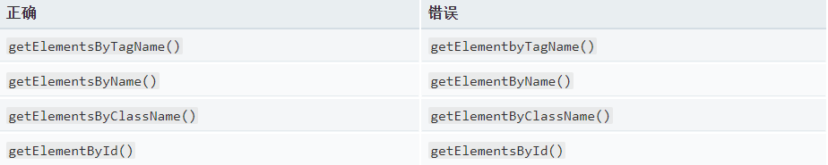
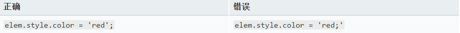

# 初学者常见的错误
以下内容指向您需要修复的日常常见问题的解决方案，以使您的JavaScript代码正确运行。

<br>

#### **一，正确的拼写和使用**
1)如果你的代码不工作或浏览器抱怨某些东西是未定义的，请检查你是否正确拼写了所有的变量名称，函数名称等。
>导致问题的一些常见的内置浏览器函数有:


2)分号位置
必须确保没有错误的放置分号，例如：


3)函数
* 函数有很多容易出错的地方,最常见的错误之一是函数被声明了却没有被调用。例如：
```js
function myFunction() {
  alert('This is my function.');
};
```
>这个函数不会执行，除非你调用它，例如：
`myFunction();`

* 函数作用域
记住函数拥有自己的作用域——你不能从函数外部访问一个函数内的变量值，除非你在全局声明了该变量（即不在任何函数内），或者从函数外部获得它的返回值。

* 在return语句之后运行代码
    * 当你向一个函数外部返回一个值时，JavaScript解释器会退出这个函数——在return语句运行之后，没有声明任何代码.
    * 事实上，如果您在返回语句之后有代码，某些浏览器（如Firefox）会在开发人员控制台中给您一条错误消息。 Firefox在返回语句后给你提示“无法访问的代码”。

4)对象标记法与正常赋值

当你在JavaScript中正常赋值时，使用等号：
`var myNumber = 0;`
但是在对象中，你需要使用冒号来分隔成员名称和值，并用逗号分隔每个成员，例如：
```js
var myObject = {
  name : 'Chris',
  age : 38
}
```

